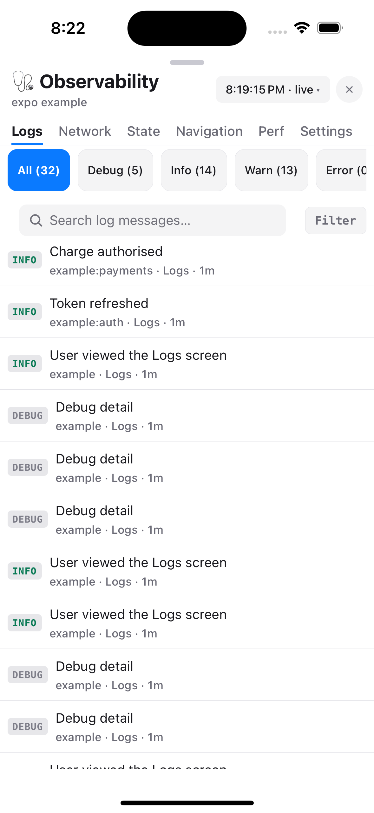
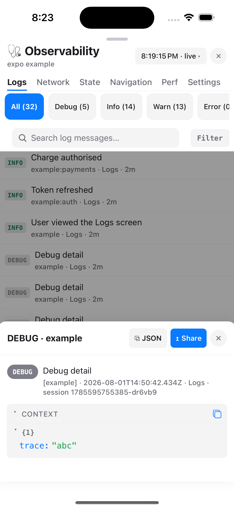
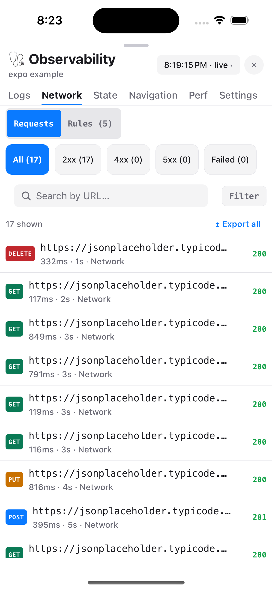
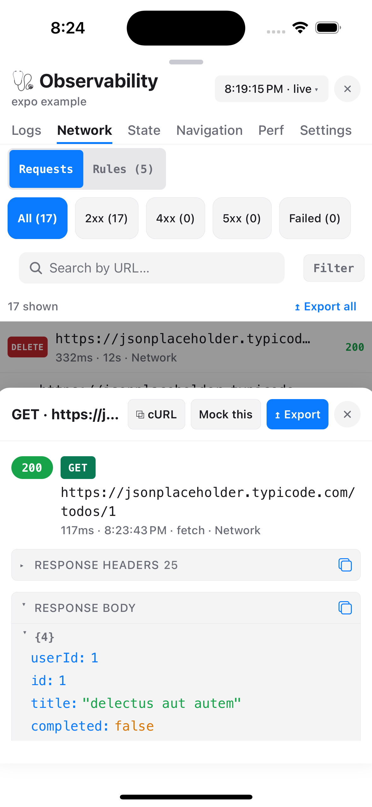
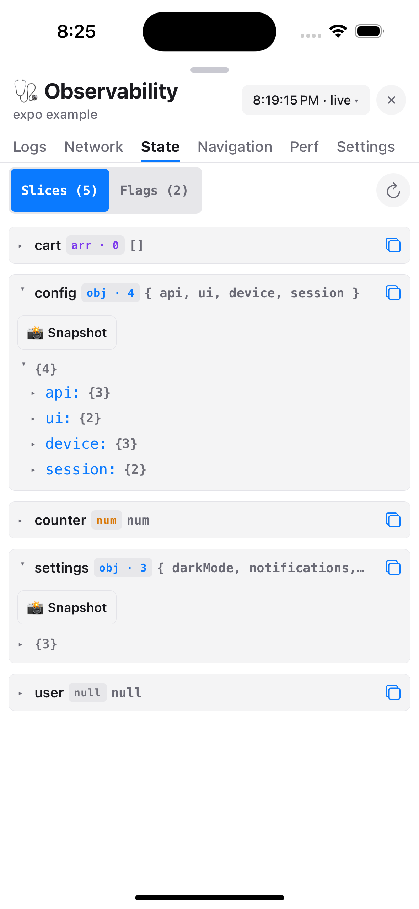
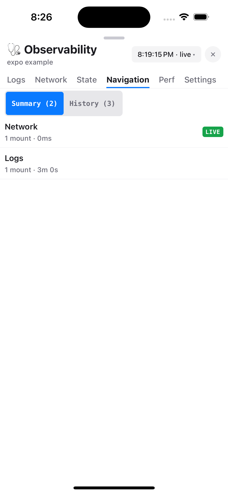
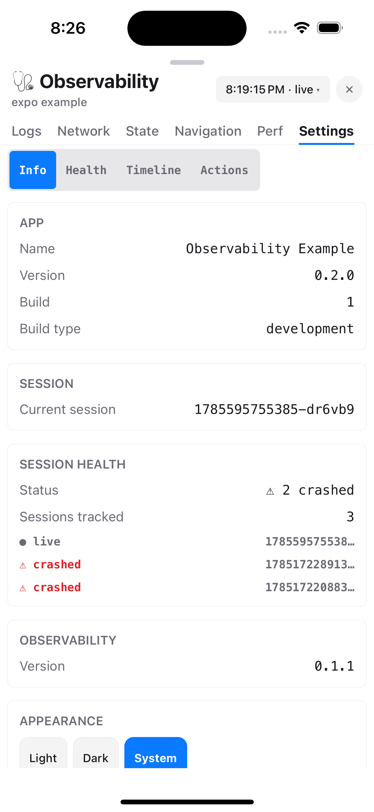
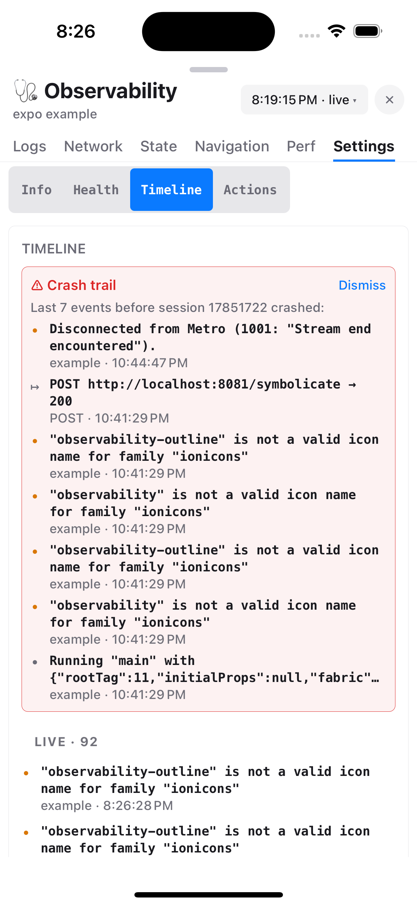
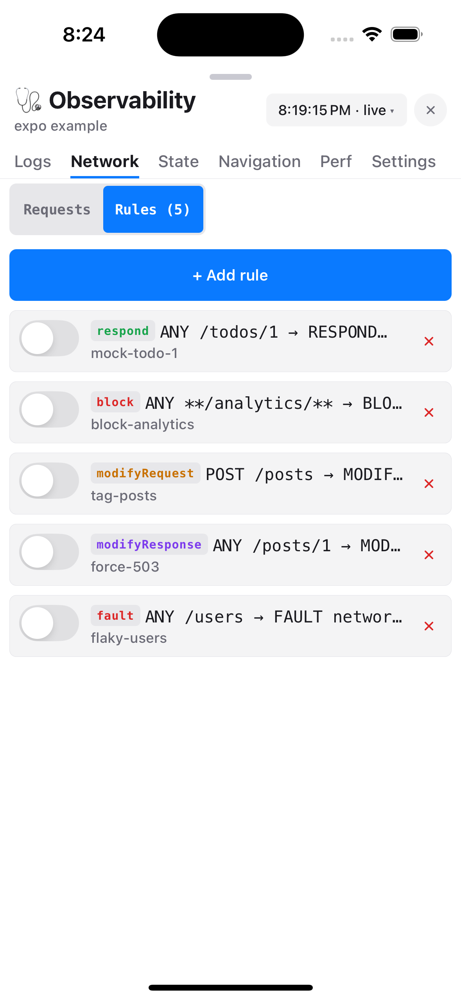
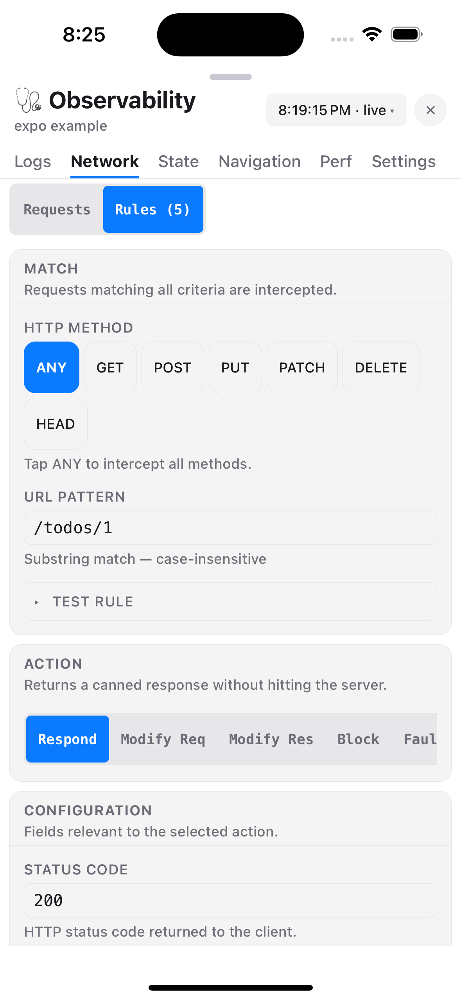

# Debug Panel

The on-device debug panel for inspecting logs, network, state, navigation, performance, and settings.

## Overview

The DebugPanelProvider mounts a full-screen React Native UI with 6+ tabs:

```tsx
<DebugPanelProvider
  enabled={__DEV__}
  logSource={memoryTransport}
  networkSource={http.store}
  openOn={['multiTap']}
  multiTapCount={5}
  gestureTab="logs"
>
  <App />
</DebugPanelProvider>
```

Open the panel via gesture (shake or multi-tap) or programmatically with `useDebugPanel().openPanel()`.

## Tabs

### Logs Tab

Displays all captured log entries. Features:

- **Level filter** — show DEBUG, INFO, WARN, ERROR, or all
- **Namespace filter** — filter by logger namespace
- **Search** — search by message, context keys
- **Export** — copy or share logs

 

```ts
<DebugPanelProvider
  logSource={memoryTransport}
  tabs={['logs', /* ... */]}
>
```

### Network Tab

Displays all HTTP requests. Features:

- **Method filter** — show GET, POST, PUT, DELETE, etc.
- **Status filter** — show by HTTP status
- **Duration sorting** — find slow requests
- **Request/response inspection** — view headers and bodies (redacted)
- **Export** — copy HAR or JSON

 

```ts
<DebugPanelProvider
  networkSource={http.store}
  tabs={['network', /* ... */]}
>
```

### State Tab

Display app state slices and feature flags. Pass app-provided state:



```ts
<DebugPanelProvider
  stateSlices={{ user: currentUser, settings: appSettings }}
  tabs={['state', /* ... */]}
>
```

The panel displays state as JSON with syntax highlighting.

### Navigation Tab

Displays screen stack and transitions. Automatically populated by `observeReactNavigation()`:



```ts
observeReactNavigation(navRef, { logger });

<DebugPanelProvider
  tabs={['navigation', /* ... */]}
>
```

### Performance Tab (Opt-in)

Display performance spans. Opt-in by including `'performance'` in tabs:

```ts
import { trackPerformance } from 'react-native-observability';

<DebugPanelProvider
  tabs={['logs', 'network', 'state', 'navigation', 'performance', 'settings']}
>
```

### Settings Tab

Display and control:

- **Appearance** — theme mode (light/dark/system)
- **Session info** — current session ID, crash detection
- **Storage** — clear all logs and storage
- **Health** — internal metrics (queue depth, dropped entries, etc.)
- **Timeline** — breadcrumb crash trail (if configured)

 

## Opening the Panel

### Via Gesture

Multi-tap (default 5 taps):

```tsx
<DebugPanelProvider
  openOn={['multiTap']}
  multiTapCount={5}
  gestureTab="logs"
>
```

Shake gesture (requires accelerometer):

```tsx
import { useShakeDetector } from 'react-native-observability/panel';

<DebugPanelProvider
  openOn={['shake']}
  accelerometer={accelerometerSource}
>
```

### Programmatically

Use the `useDebugPanel()` hook:

```tsx
import { useDebugPanel } from 'react-native-observability/panel';

export function MyScreen() {
  const { openPanel, closePanel } = useDebugPanel();
  return <Button onPress={() => openPanel('logs')} title="📊 Open Debug Panel" />;
}
```

## Theming

The panel supports light, dark, and system theming:

```tsx
<DebugPanelProvider
  theme="system"  // 'light' | 'dark' | 'system'
>
```

Use a theme preset:

```ts
import { themePresets } from 'react-native-observability/panel';

<DebugPanelProvider
  theme={themePresets.midnight}  // dark preset
>
```

Customize colors and spacing:

```ts
import { lightTokens } from 'react-native-observability/panel';

const customTheme = {
  ...lightTokens,
  colors: {
    ...lightTokens.colors,
    accent: '#ff6b6b',  // custom accent
    surface: '#f5f5f5',
  },
};

<DebugPanelProvider
  theme={customTheme}
>
```

## Persistence

Persist panel preferences (active tab, filters, theme) across app restarts:

```tsx
<DebugPanelProvider
  persist={{
    getItem: (key) => storage.getString(key) ?? null,
    setItem: (key, value) => storage.set(key, value),
  }}
>
```

Uses the same MMKV instance as the logger for consistency.

## Branding

Customize the panel header:

```tsx
<DebugPanelProvider
  branding={{
    title: 'My App',
    subtitle: 'Debug Panel v1.0',
  }}
>
```

## Icon Customization

Inject custom icons (e.g., Ionicons) to match your app:

```ts
import { Ionicons } from '@expo/vector-icons';
import type { IconSet } from 'react-native-observability/panel';

const customIcons: IconSet = {
  close: ({ size, color }) => <Ionicons name="close" size={size} color={color} />,
  search: ({ size, color }) => <Ionicons name="search" size={size} color={color} />,
  copy: ({ size, color }) => <Ionicons name="copy" size={size} color={color} />,
  // ... more icons
};

<DebugPanelProvider
  iconSet={customIcons}
>
```

Falls back to built-in Unicode glyphs for unmapped icons.

## Haptic Feedback

Inject haptic feedback for interactions:

```ts
import { Haptics } from 'expo-haptics';

<DebugPanelProvider
  haptics={{
    impact: () => Haptics.impactAsync(Haptics.ImpactFeedbackStyle.Light),
    notify: () => Haptics.notificationAsync(Haptics.NotificationFeedbackType.Warning),
  }}
>
```

Without haptics, interactions are silent.

## Safe Area Insets

Ensure the panel clears the notch or gesture bar:

```ts
import { useSafeAreaInsets } from 'react-native-safe-area-context';

export function App() {
  const insets = useSafeAreaInsets();
  return (
    <DebugPanelProvider
      safeAreaInsets={insets}
    >
      <Root />
    </DebugPanelProvider>
  );
}
```

## Session Logs

Allow users to view logs from past sessions:

```ts
<DebugPanelProvider
  getSessionLogs={(sessionId) => mmkvTransport.getEntriesForSession(sessionId)}
>
```

The panel's Settings tab includes a session selector. Selecting a past session shows its logs (read-only).

## Storage Clearing

Provide a callback for the "Clear All" button in Settings:

```ts
<DebugPanelProvider
  onClearStorage={() => {
    // Clear all persisted data
    const keys = storage.getAllKeys();
    keys.forEach(key => storage.delete(key));
    logger.warn('Cleared all storage');
  }}
>
```

## Mock Engine

Wire the network mock engine for live rule editing:

```ts
<DebugPanelProvider
  mockEngine={mockEngine}
>
```

The Network tab's **Rules** section lets you create, edit, toggle, and delete mock rules without restarting the app. Changes take effect on the next matching request immediately.

### Rule Details editor

Tapping a rule row (or **+ Add rule**) opens the Rule Details editor — a sectioned form inspired by Android Studio's Network Inspector:

 

| Section           | What it contains                                                                                                    |
| ----------------- | ------------------------------------------------------------------------------------------------------------------- |
| **Match**         | HTTP method chips (ANY / GET / POST …) + URL pattern field + optional inline pattern tester                         |
| **Action**        | Segmented control: Respond · Modify Req · Modify Res · Block · Fault                                                |
| **Configuration** | Fields relevant to the selected action only (status, headers, body, delay, fault type)                              |
| **Advanced**      | Collapsed by default — holds less-common fields such as request URL/method overrides and intermittent fault cadence |

**URL pattern types** (shown as a live hint beneath the field):

- **Empty** — matches any URL.
- **Substring** — case-insensitive substring match (e.g. `/api/orders`).
- **Glob** — `*` matches any non-slash run; `**` matches across path segments (e.g. `**/ads/**`).

**Test Rule**: expand the "Test Rule" panel inside the Match section to enter a sample URL and method and see immediately whether the current pattern would match — no engine round-trip needed.

**Response Headers / Request Headers**: structured key/value rows with add/remove buttons and duplicate-key warnings. No more free-text multi-line inputs.

**Body editor**: a mono editor with inline JSON validation. A "Format" button pretty-prints valid JSON. Non-JSON content is accepted and sent as a raw string (matching the engine's fallback behaviour).

**Action reference**:

| Action              | Effect                                                                                                                                                                                  |
| ------------------- | --------------------------------------------------------------------------------------------------------------------------------------------------------------------------------------- |
| **Respond**         | Returns a canned status/headers/body, skipping the network entirely.                                                                                                                    |
| **Modify Request**  | Mutates headers/body (and optionally method/URL via Advanced) before the real request goes out.                                                                                         |
| **Modify Response** | Transforms the real response's status/headers/body before the app sees it.                                                                                                              |
| **Block**           | Rejects the request immediately with a synthetic network error.                                                                                                                         |
| **Fault**           | Injects a Timeout (hangs then fails after a configurable delay) or Disconnect (immediate network error). Use **Advanced → Inject every Nth match** for intermittent failure simulation. |

For practical recipes — mocking any endpoint, forcing 400/500 errors, simulating timeouts, injecting auth headers — see the **[Network Rules guide](./network-rules.md)**.

## Disabling in Production

Always conditionally enable:

```tsx
<DebugPanelProvider
  enabled={__DEV__} // disabled in production
>
  <App />
</DebugPanelProvider>
```

Or use feature flags:

```tsx
<DebugPanelProvider
  enabled={featureFlags.debugPanelEnabled}
>
```

## Best Practices

### Keep Panels Lightweight

Don't log extremely large objects to the panel:

```ts
// ✓ Good
logger.info('User data', { id: userId, email: userEmail });

// ✗ Poor
logger.info('User data', entireUserObject); // huge JSON in panel
```

### Use Appropriate Tabs

Include only tabs you need:

```tsx
// Minimal setup
<DebugPanelProvider
  tabs={['logs', 'settings']}
>

// Full setup
<DebugPanelProvider
  tabs={['logs', 'network', 'state', 'navigation', 'performance', 'settings']}
>
```

### Customize for Your App

Use branding, theming, and icons to match your app's design:

```tsx
<DebugPanelProvider
  branding={{ title: 'MyApp Debug' }}
  theme={customTheme}
  iconSet={myIconSet}
>
```

### Test in Landscape

The panel should work in portrait and landscape. Test both orientations.

## Next Steps

- **[Network Rules](./network-rules.md)** — Mock, block, fault, and transform requests from the panel
- **[Theming](./debug-panel.md)** — Advanced theming
- **[Troubleshooting](./troubleshooting.md)** — Common panel issues
