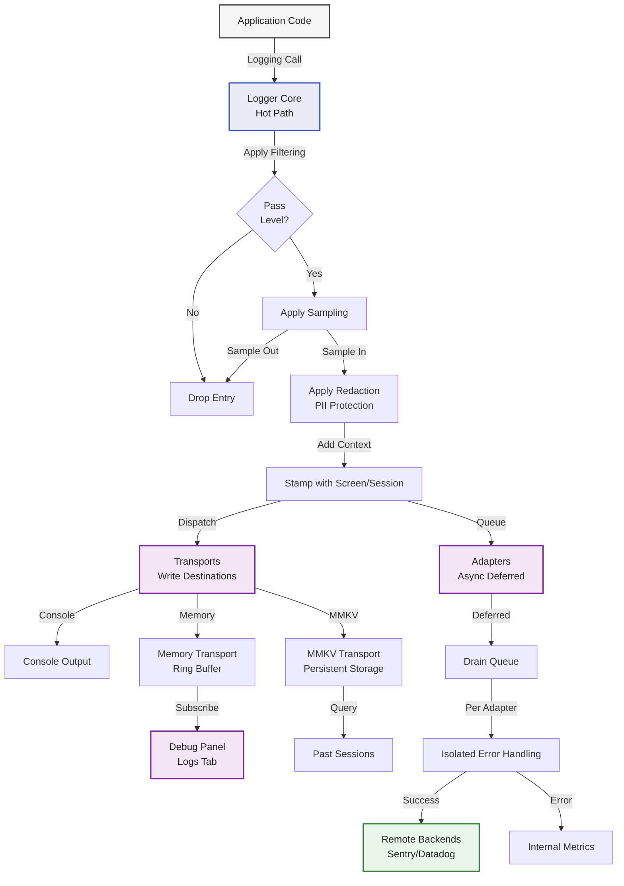
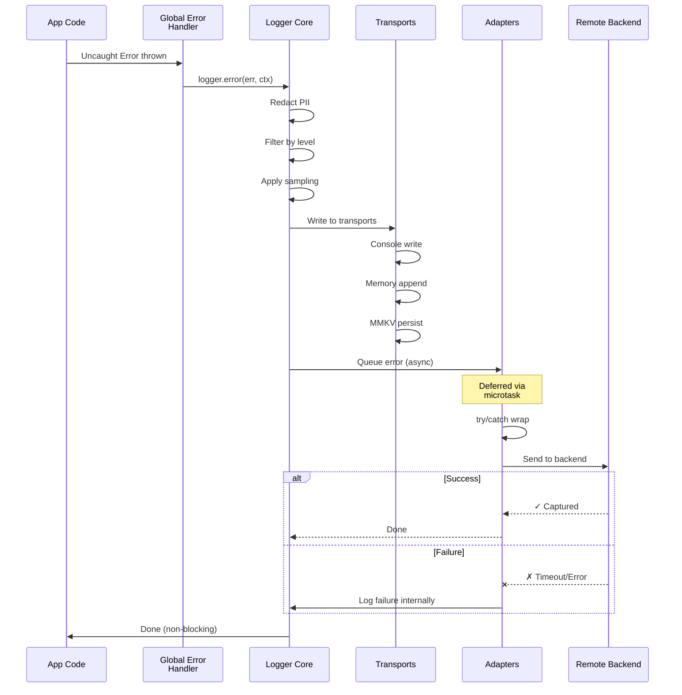
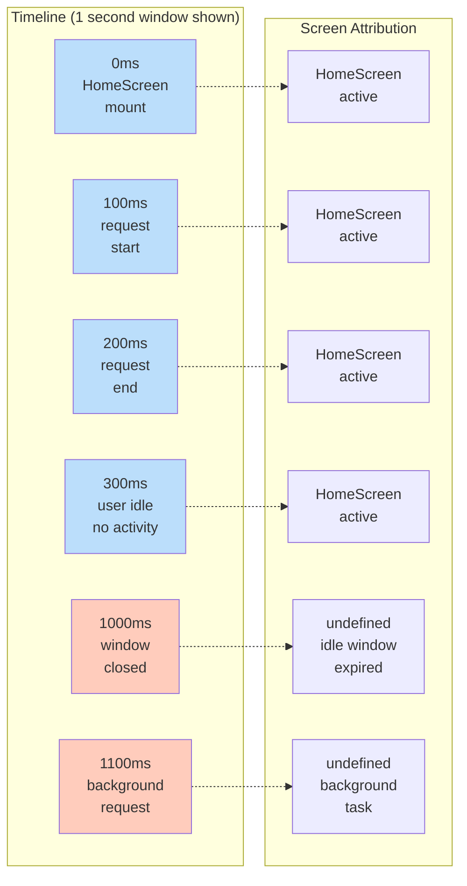
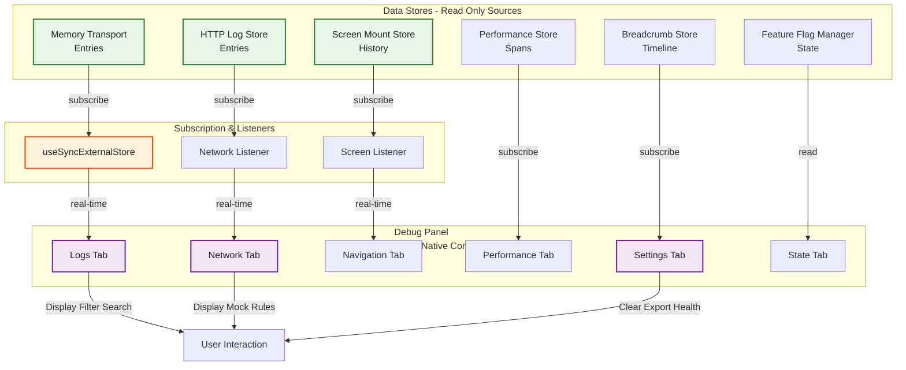
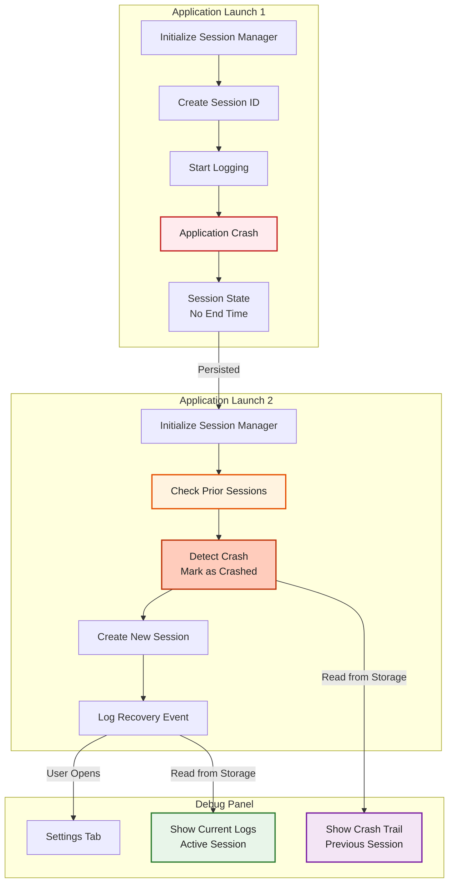
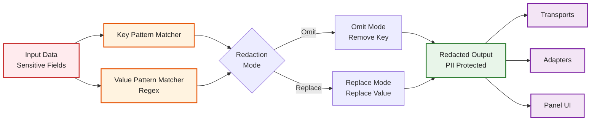
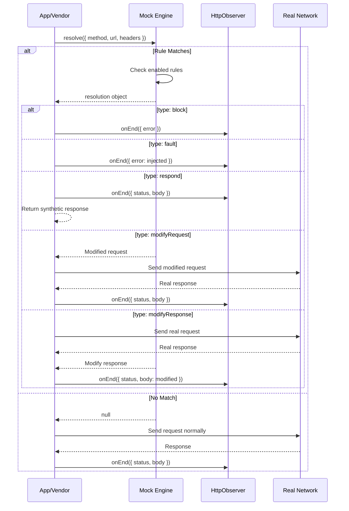
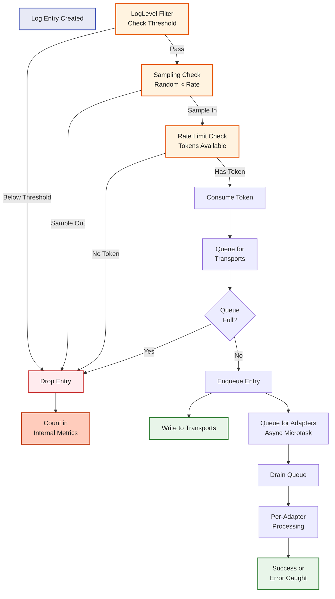

# Architecture Diagrams

Visual representations of Observability's core systems and data flows.

## Core Data Flow

How an entry flows from app code through Observability to transports, adapters, and the panel:

## Error Capture Flow

How an uncaught error gets captured, logged, and reported:

## Screen Attribution Model

How the idle-window model attributes logs and requests to screens:

## Panel Architecture

How the debug panel reads from stores and displays data:

## Session & Crash Detection Flow

How sessions are managed and crashes are detected across launches:

## Redaction Pipeline

How PII is redacted before any transport or adapter sees data:

## Mock Engine Request Interception

How the mock engine intercepts and modifies requests:

## Backpressure & Sampling

How backpressure and sampling prevent runaway logging:

## Next Steps

- [Architecture](./architecture.md) — Detailed explanations of these flows
- [API Reference](./api-reference.md) — Complete API documentation
- [Logger Guide](./logger-guide.md) — Deep dive into logging system
