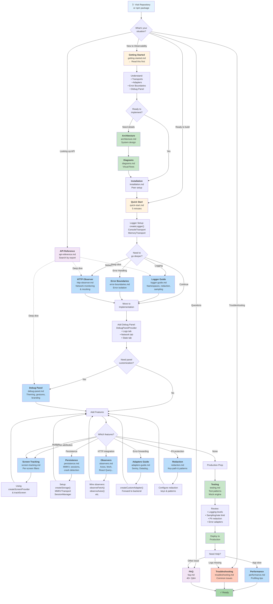
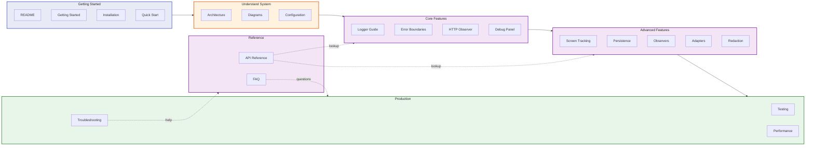
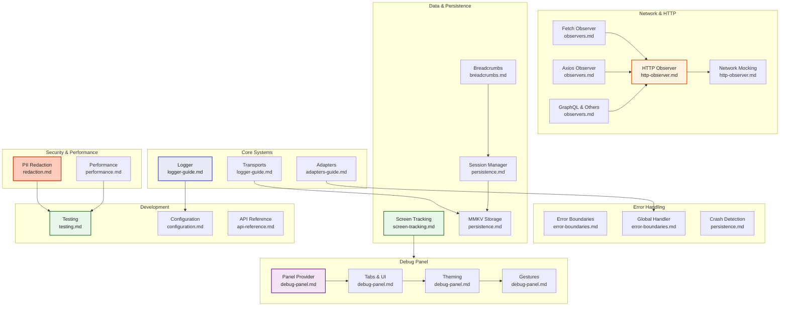
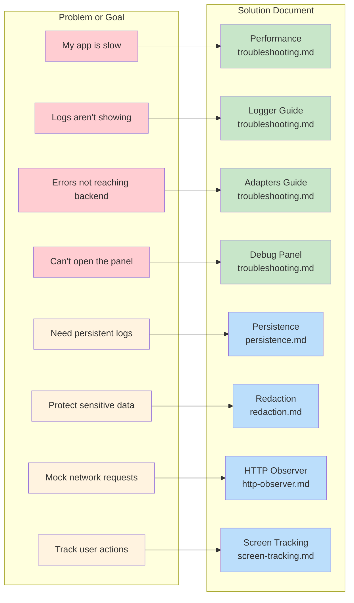

# Documentation Navigation Flow

Visual guide for navigating Observability's documentation based on user goals and experience level.

## Complete Documentation Flow

How users navigate from entry point to their goal:

## Quick Reference: Find What You Need

## User Journey by Goal

Different paths based on what you want to accomplish:

```mermaid
flowchart TD
    subgraph Beginner ["New to Observability"]
        B1["README"]
        B2["Getting Started"]
        B3["Installation"]
        B4["Quick Start"]
        B5["Logger Guide"]
    end

    subgraph QuickBuild ["Fast Development"]
        Q1["Quick Start"]
        Q2["HTTP Observer"]
        Q3["Debug Panel"]
        Q4["Examples"]
    end

    subgraph Integrate ["App Integration"]
        I1["Installation"]
        I2["Configuration"]
        I3["Screen Tracking"]
        I4["Observers"]
        I5["Adapters Guide"]
    end

    subgraph Production ["Production Ready"]
        P1["Testing"]
        P2["Troubleshooting"]
        P3["Redaction"]
        P4["Persistence"]
    end

    subgraph DeepDive ["Comprehensive Learning"]
        D1["Architecture"]
        D2["Diagrams"]
        D3["API Reference"]
        D4["All Guides"]
    end

    B1 --> B2
    B2 --> B3
    B3 --> B4
    B4 --> B5

    Q1 --> Q2
    Q2 --> Q3
    Q3 --> Q4

    I1 --> I2
    I2 --> I3
    I3 --> I4
    I4 --> I5

    P1 --> P2
    P2 --> P3
    P3 --> P4

    D1 --> D2
    D2 --> D3
    D3 --> D4

    style Beginner fill:#e8eaf6,stroke:#3f51b5,stroke-width:2px,color:#212121
    style QuickBuild fill:#fff3e0,stroke:#e65100,stroke-width:2px,color:#212121
    style Integrate fill:#f3e5f5,stroke:#7b1fa2,stroke-width:2px,color:#212121
    style Production fill:#e8f5e9,stroke:#2e7d32,stroke-width:2px,color:#212121
    style DeepDive fill:#e8f5e9,stroke:#2e7d32,stroke-width:2px,color:#212121
```

## Content Map by Feature

Quickly find docs for the feature you're working on:

## Search by Problem

If you know what you're looking for:

## How to Use This Documentation

**Start here:**

1. Read the [README](../README.md) for overview
2. Follow [Getting Started](./getting-started.md)
3. Do [Quick Start](./quick-start.md) (5 minutes)

**Then choose your path:**

- **Learning** → [Architecture](./architecture.md) → [Diagrams](./diagrams.md)
- **Building** → [Configuration](./configuration.md) → [Feature Guides](./logger-guide.md)
- **Reference** → [API Reference](./api-reference.md)
- **Help** → [Troubleshooting](./troubleshooting.md) or [FAQ](./faq.md)

**Check examples:**

- [Expo Example](../examples/expo/README.md) — Go-safe, no native build
- [Bare Example](../examples/bare/README.md) — Full native surface

## Document Index

| Document                                  | Purpose                  | Best For               |
| ----------------------------------------- | ------------------------ | ---------------------- |
| [README](../README.md)                    | Package overview         | First impression       |
| [Getting Started](./getting-started.md)   | Concepts & minimum setup | Beginners              |
| [Installation](./installation.md)         | Peer dependencies        | Setup                  |
| [Quick Start](./quick-start.md)           | 5-minute integration     | Fast builders          |
| [Architecture](./architecture.md)         | System design            | Deep understanding     |
| [Diagrams](./diagrams.md)                 | Visual flows             | Visual learners        |
| [Configuration](./configuration.md)       | All config options       | Reference              |
| [API Reference](./api-reference.md)       | Complete API             | Developers             |
| [Logger Guide](./logger-guide.md)         | Logging mastery          | Advanced logging       |
| [Adapters Guide](./adapters-guide.md)     | Error forwarding         | Backend integration    |
| [Error Boundaries](./error-boundaries.md) | Error handling           | Error recovery         |
| [HTTP Observer](./http-observer.md)       | Network monitoring       | HTTP integration       |
| [Observers](./observers.md)               | Vendor integrations      | Library-specific setup |
| [Persistence](./persistence.md)           | MMKV & sessions          | Local storage          |
| [Debug Panel](./debug-panel.md)           | Panel customization      | UI personalization     |
| [Screen Tracking](./screen-tracking.md)   | Screen attribution       | Navigation             |
| [Breadcrumbs](./breadcrumbs.md)           | Timeline & crash trail   | Crash analysis         |
| [Performance](./performance.md)           | Performance spans        | Metrics & monitoring   |
| [Redaction](./redaction.md)               | PII protection           | Security               |
| [Testing](./testing.md)                   | Test patterns            | QA & testing           |
| [Troubleshooting](./troubleshooting.md)   | Common issues            | Problem solving        |
| [FAQ](./faq.md)                           | 40+ Q&A                  | Quick answers          |
